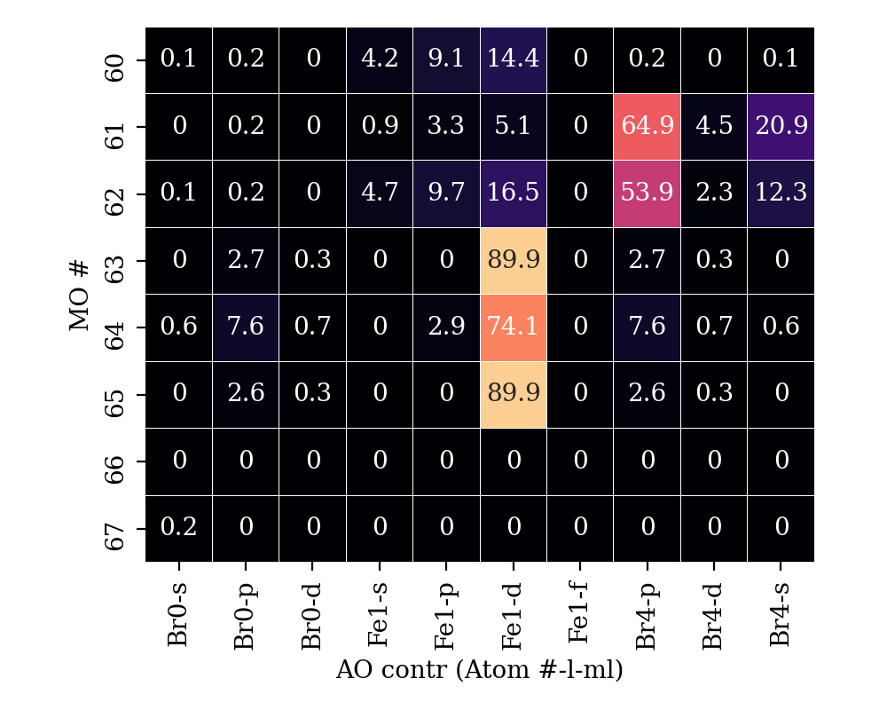

# `loewdin_plotter`
Plots specific Loewdin population of specific orbitals.

## Description
This utility helps with the identification of the orbitals character.

Reads the following block from an orca output file 
```
----------------------------
LOEWDIN ORBITAL-COMPOSITIONS
----------------------------

                      0         1         2         3         4         5   
                 -460.58703 -460.58703 -261.36807 -261.17545 -60.39280 -60.39280
                   2.00000   2.00000   2.00000   2.00000   2.00000   2.00000
                  --------  --------  --------  --------  --------  --------
 0 Fe s               0.0       0.0     100.0       0.0       0.0       0.0
 1 Se s              50.9      49.1       0.0       0.0      50.9      49.1
11 Fe s               0.0       0.0       0.0     100.0       0.0       0.0
12 Se s              49.1      50.9       0.0       0.0      49.1      50.9

                      6         7         8         9        10        11   
                 -53.99319 -53.99319 -53.99319 -53.99318 -53.99306 -53.99305
                   2.00000   2.00000   2.00000   2.00000   2.00000   2.00000
```
or
```
------------------------------------------
LOEWDIN REDUCED ORBITAL POPULATIONS PER MO
-------------------------------------------
THRESHOLD FOR PRINTING IS 0.1%
SPIN UP
                      0         1         2         3         4         5   
                 -144.18793 -18.63385 -14.84937 -12.05575 -12.05213 -12.05213
                   1.00000   1.00000   1.00000   1.00000   1.00000   1.00000
                  --------  --------  --------  --------  --------  --------
 0 Ca s             100.0       0.0      99.7       0.0       0.0       0.0
 0 Ca pz              0.0       0.0       0.0     100.0       0.0       0.0
 0 Ca px              0.0       0.0       0.0       0.0       0.0     100.0
 0 Ca py              0.0       0.0       0.0       0.0     100.0       0.0
 1 O  s               0.0      99.9       0.0       0.0       0.0       0.0
 1 O  pz              0.0       0.0       0.3       0.0       0.0       0.0
 ```

Plots a range of orbitals agains atomic orbital contributions.
Some options to reduce the printout are offered (see `--help` for details).

## Example
The molecule is FeBr2Cl2.
The 5 d orbitals of Fe (atom index 1 ) are already in the active space (63-67). 
Running `plot_loewdin.py example.out --output example.png --range 60 67 --collapse 1 --atoms Fe Br` will print the contributions of Fe and Br to orbitals 60 to 67, and sum up the `m_l` for each `l`. 
One can also specify atoms by index and sum up all contributions from each atom.



## Requirements
Tested with `ORCA 4.2`
- `python3`
	- `seaborn`

## Contributor
Contributed by Nico Spiller
